# EPMS Project Initiation - Architecture Documentation

This document collates all sequence diagrams and architectural artifacts for the Project Initiation module of the Enterprise Project Management System (EPMS).

## Table of Contents
1. [System Overview](#system-overview)
2. [Entity Relationship Diagram](#entity-relationship-diagram)
3. [Program Management](#program-management)
4. [Value Creation Framework (VCF)](#value-creation-framework-vcf)
5. [Project Management](#project-management)
6. [Approval Workflows](#approval-workflows)
7. [Search and View Operations](#search-and-view-operations)

---

## System Overview

### High-Level Initiation Flow

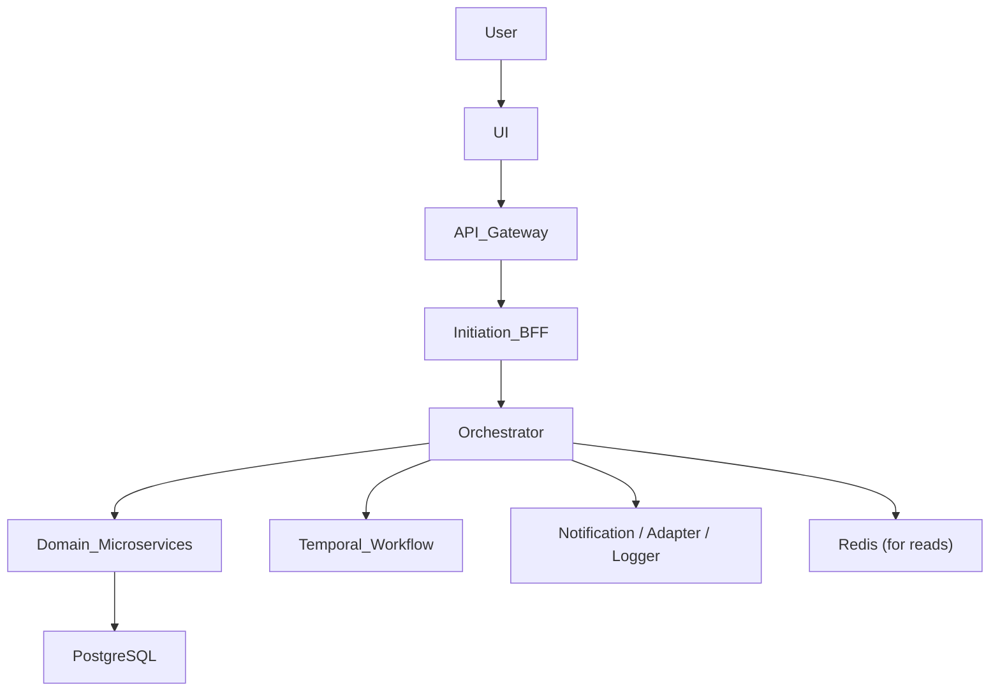

### User Role Flow Chart

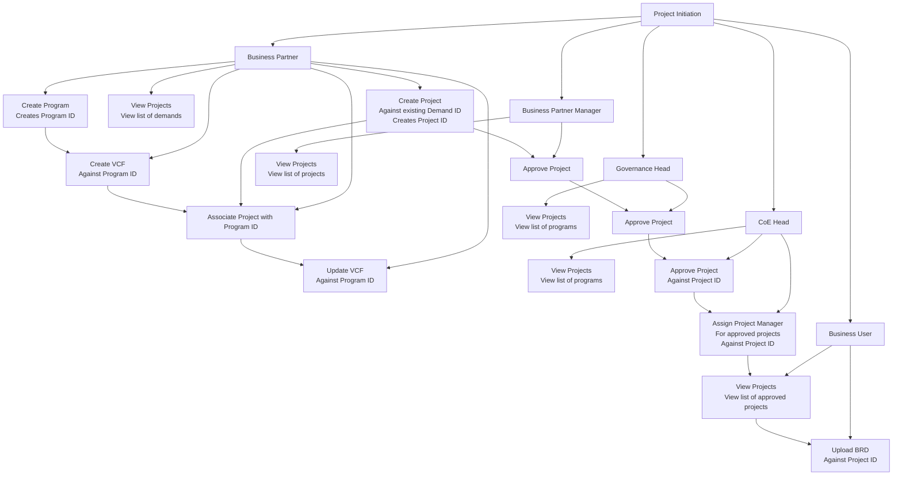

---

## Entity Relationship Diagram

The following ERD represents the core data model for the Project Initiation module:

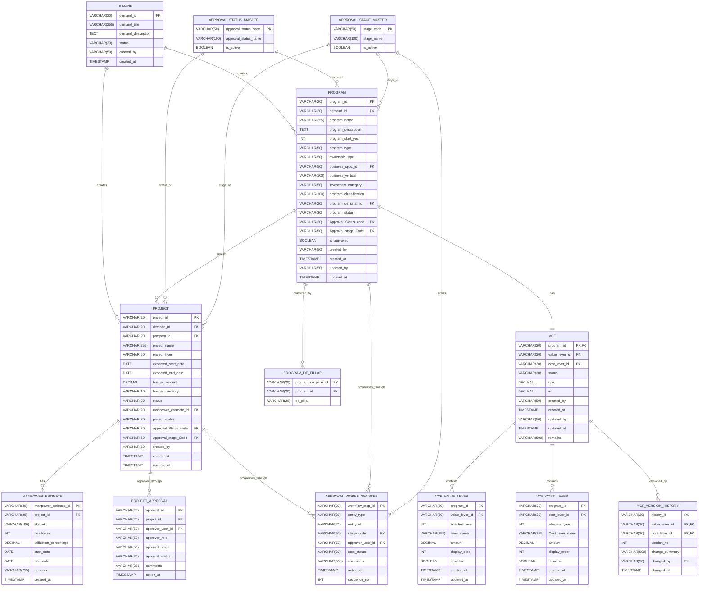

---

## Program Management

### 3.1 Program Creation

**Description**: Business Partner creates a program against an existing Demand ID. The program is initially saved in DRAFT status and goes through validation including demand validation and optional HRMS lookup for Business SPOC details.

**Key Points**:
- Demand is validated first
- Program is created against an existing Demand ID
- Business SPOC / employee details may be fetched from HRMS via Service Adapter
- Program is initially saved in DRAFT
- Orchestrator coordinates: demand validation, HRMS lookup, program creation, status/approval status/stage initialization, workflow step creation

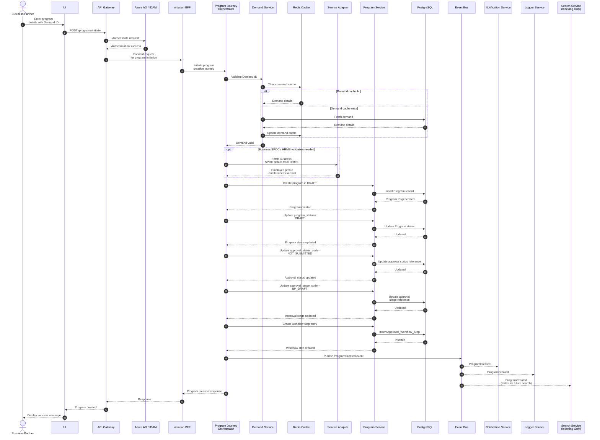

### 3.2 Program View and Search (Business Partner)

**Description**: Business Partner searches and views programs with caching support.

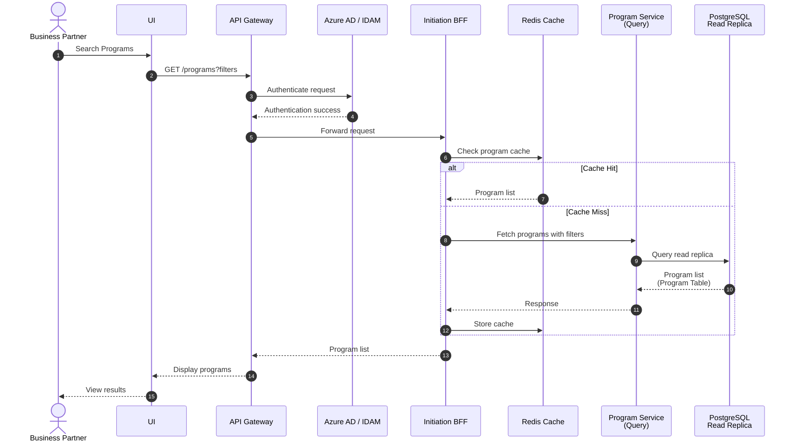

### 3.3 Program View and Search (Governance Head / CoE Head)

**Description**: Governance Head and CoE Head can view programs along with VCF data.

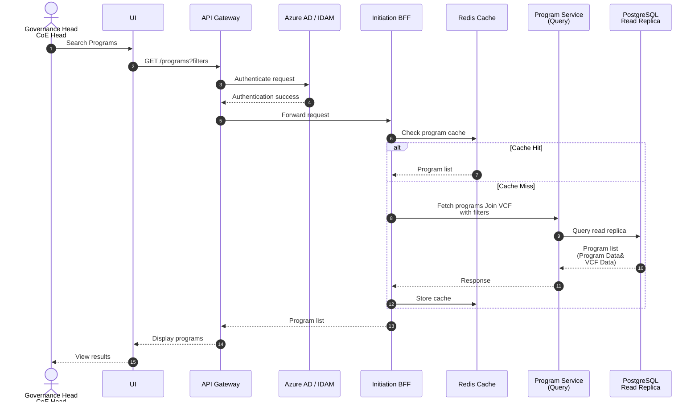

---

## Value Creation Framework (VCF)

### 4.1 VCF Entry

**Description**: Business Partner enters VCF details for a program including value levers and cost levers.

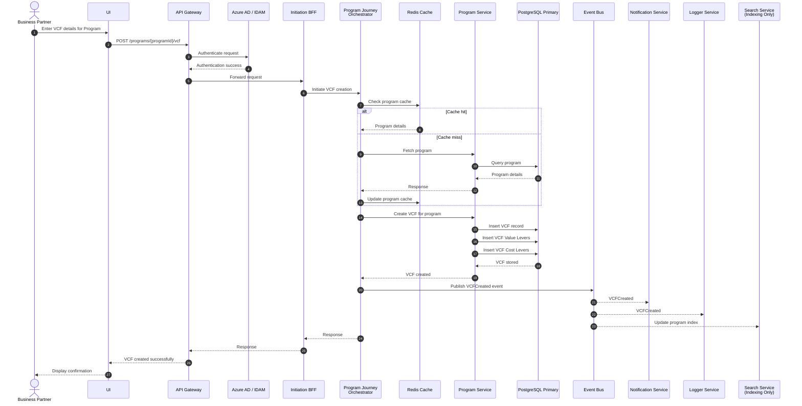

### 4.2 VCF Update by Program ID

**Description**: Business Partner updates VCF for an existing program. The system maintains version history of VCF changes.

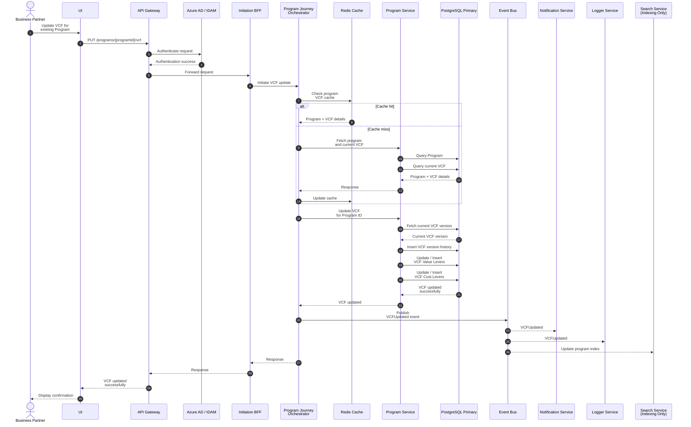

---

## Project Management

### 5.1 Project Creation against Demand (Simple Flow)

**Description**: Basic flow for creating a project against a demand.

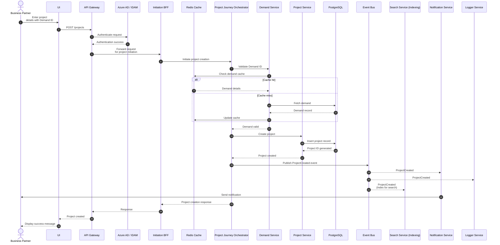

### 5.2 Project Creation against Demand - Part 1 (Detailed Flow)

**Description**: Validates demand, checks if program exists, fetches VCF, and either continues with project creation or redirects to program creation.

**Key Points**:
1. Validate Demand ID
2. Check whether a Program already exists for that demand/selected context
3. If program exists: fetch program details, fetch existing VCF details, continue project creation flow
4. If program does not exist: open/redirect to program creation flow, save project as DRAFT

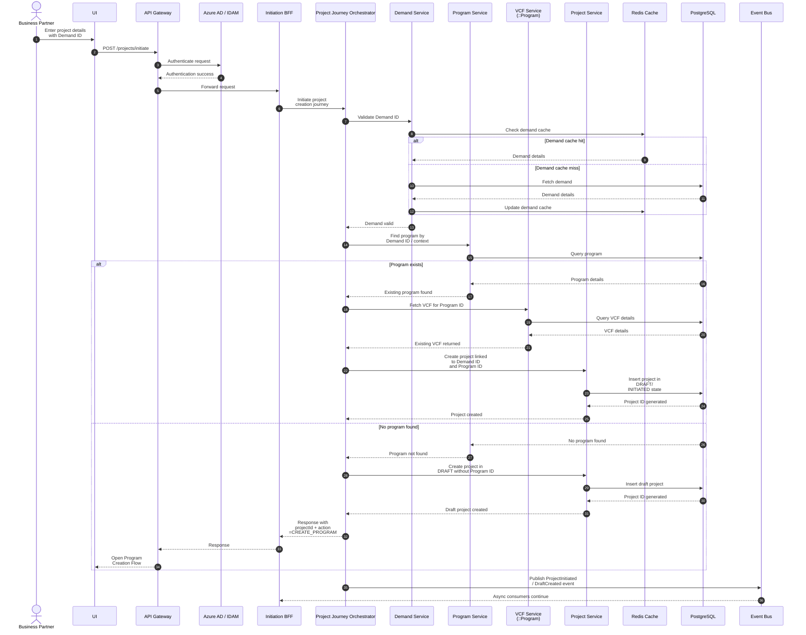

### 5.3 Project Creation against Demand - Part 2 (Status Updates)

**Description**: Updates status, approval stage, workflow step, and publishes side effects after project creation.

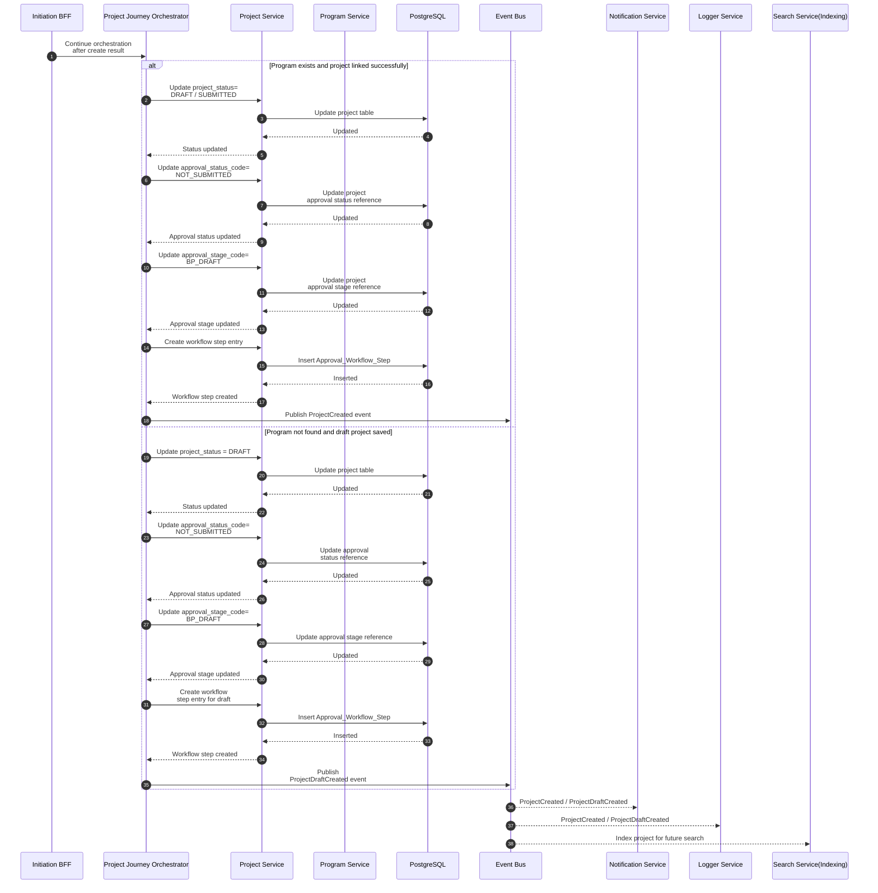

---

## Approval Workflows

### 6.1 Project Approval - Business Partner Manager (BPM)

**Description**: Business Partner Manager approves a project and forwards it to Governance Head for next level approval.

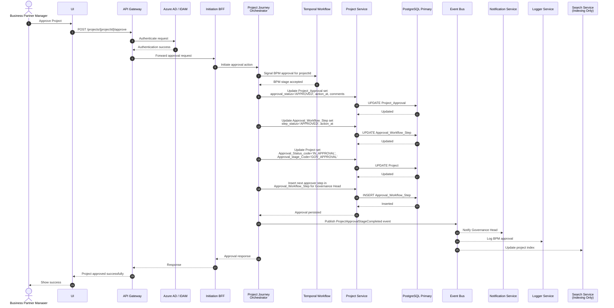

### 6.2 Project Approval - Governance Head (GH)

**Description**: Governance Head approves a project and forwards it to CoE Head for final approval.

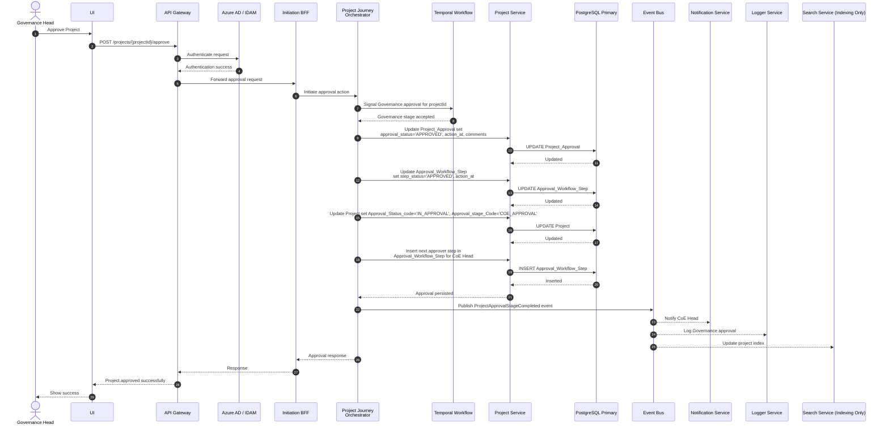

### 6.3 Project Approval - CoE Head (Final Approval)

**Description**: CoE Head provides final approval. Project status is updated to APPROVED and can proceed to next phase.

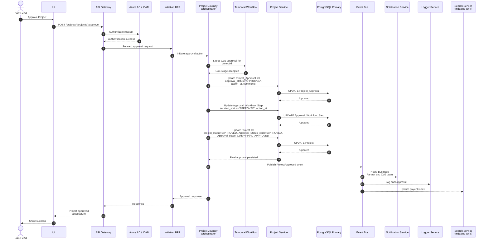

### 6.4 Reject or Send Back Approval

**Description**: Any approver (BPM/Governance Head/CoE Head) can reject a project or send it back for revisions.

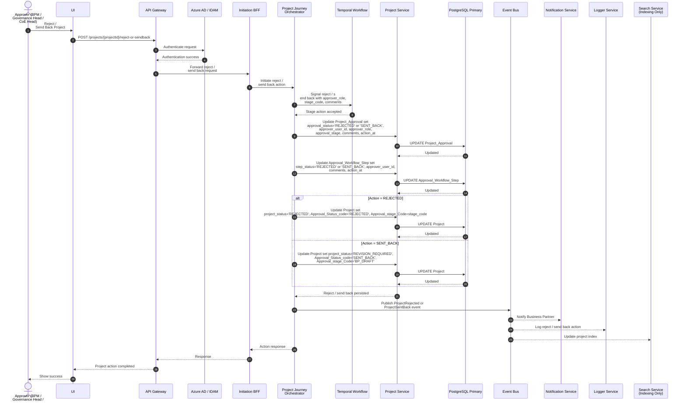

### 6.5 Assign Project Manager

**Description**: After final approval, CoE Head assigns a Project Manager to the approved project.

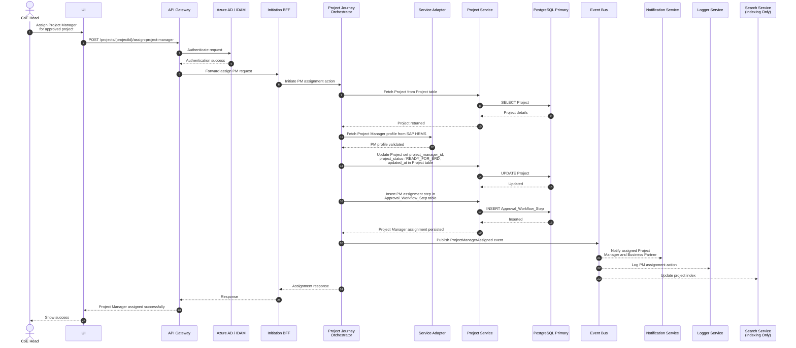

---

## Search and View Operations

### 7.1 Project View and Search (All Roles)

**Description**: All user roles (Business Partner, BPM, Governance Head, CoE Head, Business User) can search and view projects based on their permissions.

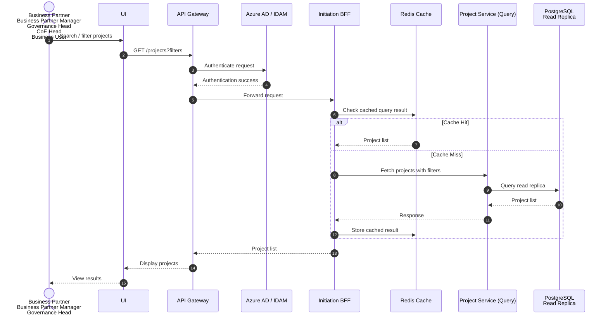

---

## Architecture Principles

### Key Design Patterns

1. **Orchestration Pattern**: Journey orchestrators coordinate multi-step workflows
2. **CQRS Pattern**: Separate read and write operations with read replicas
3. **Event-Driven Architecture**: Asynchronous communication via Event Bus
4. **Cache-Aside Pattern**: Redis caching for frequently accessed data
5. **Service Adapter Pattern**: Integration with external systems (HRMS, SAP)

### Technology Stack

- **API Gateway**: Entry point for all requests
- **Authentication**: Azure AD / IDAM
- **BFF (Backend for Frontend)**: Initiation BFF
- **Orchestration**: Temporal Workflow Engine
- **Databases**: PostgreSQL (Primary + Read Replicas)
- **Caching**: Redis
- **Messaging**: Event Bus
- **Services**: Microservices architecture with domain-driven design

### Data Flow

1. **Write Path**: UI → API Gateway → BFF → Orchestrator → Domain Services → PostgreSQL Primary → Event Bus
2. **Read Path**: UI → API Gateway → BFF → Cache (if hit) OR Query Services → PostgreSQL Read Replica

### Security & Compliance

- All requests authenticated via Azure AD/IDAM
- Role-based access control (RBAC) for different user types
- Audit logging via Logger Service
- Secure communication between services

---

## Conclusion

This architecture document provides a comprehensive overview of the Project Initiation module's sequence diagrams and workflows. The system follows modern microservices patterns with clear separation of concerns, event-driven communication, and robust approval workflows.

**Key Features**:
- Multi-stage approval workflow (BP → BPM → GH → CoE Head)
- Program and Project lifecycle management
- Value Creation Framework (VCF) with version control
- Comprehensive search and view capabilities
- Integration with external systems (HRMS, SAP)
- Scalable and maintainable architecture

---

*Document Generated: March 13, 2026*  
*Version: 1.0*  
*Source: Project Initiation Diagrams from `/02 Solution Architecture/diagrams/Project Initiation`*
