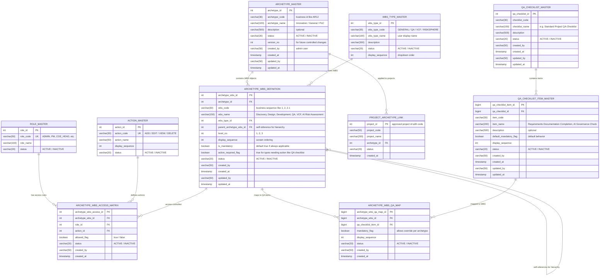

# EPMS Governance & Archetype Management - Data Model

This document defines the database schema for the Governance and Archetype Management module of the Enterprise Project Management System (EPMS).

## Table of Contents
1. [Entity Relationship Diagram](#entity-relationship-diagram)
2. [Role & Access Control Tables](#role--access-control-tables)
3. [Archetype Management Tables](#archetype-management-tables)
4. [WBS Management Tables](#wbs-management-tables)
5. [QA Checklist Tables](#qa-checklist-tables)

---

## Entity Relationship Diagram



---

## Role & Access Control Tables

### 1. Role Master

This table stores user roles and should preferably reuse your enterprise/shared role master.

| Column | Type | Key | Notes |
|--------|------|-----|-------|
| `role_id` | `int` | PK | Primary key, auto-increment |
| `role_code` | `varchar(50)` | UK | Unique identifier: ADMIN, PM, COE_HEAD, etc. |
| `role_name` | `varchar(100)` | | Display name for the role |
| `status` | `varchar(20)` | | ACTIVE / INACTIVE |

**Example Data:**
| role_id | role_code | role_name | status |
|---------|-----------|-----------|--------|
| 1 | ADMIN | System Administrator | ACTIVE |
| 2 | PM | Project Manager | ACTIVE |
| 3 | COE_HEAD | CoE Head | ACTIVE |
| 4 | BP | Business Partner | ACTIVE |
| 5 | BPM | Business Partner Manager | ACTIVE |

---

### 2. Action Master for Access Control

Stores actions shown on access tab.

| Column | Type | Key | Notes |
|--------|------|-----|-------|
| `action_id` | `int` | PK | Primary key, auto-increment |
| `action_code` | `varchar(30)` | UK | Unique identifier: ADD / EDIT / VIEW / DELETE |
| `action_name` | `varchar(50)` | | Display name for the action |
| `display_sequence` | `int` | | Order in which actions appear in UI |
| `status` | `varchar(20)` | | ACTIVE / INACTIVE |

**Example Data:**
| action_id | action_code | action_name | display_sequence | status |
|-----------|-------------|-------------|------------------|--------|
| 1 | VIEW | View | 1 | ACTIVE |
| 2 | ADD | Add | 2 | ACTIVE |
| 3 | EDIT | Edit | 3 | ACTIVE |
| 4 | DELETE | Delete | 4 | ACTIVE |
| 5 | APPROVE | Approve | 5 | ACTIVE |

---

### 3. Archetype WBS Access Matrix

Stores who can do what on each WBS object.

| Column | Type | Key | Notes |
|--------|------|-----|-------|
| `archetype_wbs_access_id` | `int` | PK | Primary key, auto-increment |
| `archetype_wbs_id` | `int` | FK | References `ARCHETYPE_WBS_DEFINITION.archetype_wbs_id` |
| `role_id` | `int` | FK | References `ROLE_MASTER.role_id` |
| `action_id` | `int` | FK | References `ACTION_MASTER.action_id` |
| `allowed_flag` | `boolean` | | true = allowed, false = denied |
| `status` | `varchar(20)` | | ACTIVE / INACTIVE |
| `created_by` | `varchar(50)` | | User who created this rule |
| `created_at` | `timestamp` | | Creation timestamp |

**Business Rules:**
- Defines fine-grained access control at WBS object level
- Combination of (archetype_wbs_id, role_id, action_id) should be unique
- If no entry exists for a role-action-WBS combination, default to denied access
- Supports role-based access control (RBAC) pattern

---

## Archetype Management Tables

### 4. Archetype Master

Stores archetypes like Innovation, General, PoC.

| Column | Type | Key | Notes |
|--------|------|-----|-------|
| `archetype_id` | `int` | PK | Primary key, auto-increment |
| `archetype_code` | `varchar(30)` | | Business identifier like AR12 |
| `archetype_name` | `varchar(100)` | | Innovation / General / PoC |
| `description` | `varchar(500)` | | Optional description |
| `status` | `varchar(20)` | | ACTIVE / INACTIVE |
| `version_no` | `int` | | For future controlled changes |
| `created_by` | `varchar(50)` | | Admin user who created |
| `created_at` | `timestamp` | | Creation timestamp |
| `updated_by` | `varchar(50)` | | User who last updated |
| `updated_at` | `timestamp` | | Last update timestamp |

**Example Data:**
| archetype_id | archetype_code | archetype_name | description | status | version_no |
|--------------|----------------|----------------|-------------|--------|------------|
| 1 | AR001 | Innovation | For innovation projects | ACTIVE | 1 |
| 2 | AR002 | General | Standard project archetype | ACTIVE | 1 |
| 3 | AR003 | PoC | Proof of Concept projects | ACTIVE | 1 |
| 4 | AR004 | AI/ML Initiative | AI and ML focused projects | ACTIVE | 1 |

---

### 5. Project Archetype Link

For future project planning, each project stores its selected archetype.

| Column | Type | Key | Notes |
|--------|------|-----|-------|
| `project_id` | `int` | PK | Approved project ID with code |
| `project_code` | `varchar(50)` | | Business project identifier |
| `project_name` | `varchar(200)` | | Project name |
| `archetype_id` | `int` | FK | References `ARCHETYPE_MASTER.archetype_id` |
| `status` | `varchar(20)` | | ACTIVE / INACTIVE / ARCHIVED |
| `created_at` | `timestamp` | | Timestamp when link was created |

**Business Rules:**
- One project can have only one archetype at a time
- Archetype selection typically happens during project approval phase
- Changing archetype after project start should trigger workflow/approval
- Historical archetype assignments can be maintained via audit tables

---

## WBS Management Tables

### 6. WBS Type Master

Stores allowed WBS object types.

| Column | Type | Key | Notes |
|--------|------|-----|-------|
| `wbs_type_id` | `int` | PK | Primary key, auto-increment |
| `wbs_type_code` | `varchar(30)` | | GENERAL / QA / VCF / RISKSPHERE |
| `wbs_type_name` | `varchar(100)` | | User display name |
| `description` | `varchar(300)` | | Description of WBS type |
| `status` | `varchar(20)` | | ACTIVE / INACTIVE |
| `display_sequence` | `int` | | Dropdown order in UI |

**Example Data:**
| wbs_type_id | wbs_type_code | wbs_type_name | description | status | display_sequence |
|-------------|---------------|---------------|-------------|--------|------------------|
| 1 | GENERAL | General Phase | Standard project phase | ACTIVE | 1 |
| 2 | QA | Quality Assurance | QA checkpoint phase | ACTIVE | 2 |
| 3 | VCF | Value Creation Framework | VCF evaluation phase | ACTIVE | 3 |
| 4 | RISKSPHERE | AI Risk Assessment | AI governance checkpoint | ACTIVE | 4 |
| 5 | MILESTONE | Milestone | Key project milestone | ACTIVE | 5 |

---

### 7. Archetype WBS Definition

Stores WBS objects for each archetype.

| Column | Type | Key | Notes |
|--------|------|-----|-------|
| `archetype_wbs_id` | `int` | PK | Primary key, auto-increment |
| `archetype_id` | `int` | FK | References `ARCHETYPE_MASTER.archetype_id` |
| `wbs_code` | `varchar(30)` | | Business sequence like 1, 2, 2.1 |
| `wbs_name` | `varchar(150)` | | Discovery, Design, Development, QA, VCF, AI Risk Assessment |
| `wbs_type_id` | `int` | FK | References `WBS_TYPE_MASTER.wbs_type_id` |
| `parent_archetype_wbs_id` | `int` | FK (self) | Supports hierarchy like Design → AS-IS / TO-BE |
| `level_no` | `int` | | Hierarchy level: 1, 2, 3, etc. |
| `display_sequence` | `int` | | Screen ordering |
| `is_mandatory` | `boolean` | | Default true if always applicable |
| `action_required_flag` | `boolean` | | True for types needing action like QA checklist |
| `status` | `varchar(20)` | | ACTIVE / INACTIVE |
| `created_by` | `varchar(50)` | | User who created |
| `created_at` | `timestamp` | | Creation timestamp |
| `updated_by` | `varchar(50)` | | User who last updated |
| `updated_at` | `timestamp` | | Last update timestamp |

**Example Data:**
| archetype_wbs_id | archetype_id | wbs_code | wbs_name | wbs_type_id | parent_archetype_wbs_id | level_no | is_mandatory |
|------------------|--------------|----------|----------|-------------|-------------------------|----------|--------------|
| 1 | 1 | 1 | Discovery | 1 | NULL | 1 | true |
| 2 | 1 | 2 | Design | 1 | NULL | 1 | true |
| 3 | 1 | 2.1 | AS-IS Design | 1 | 2 | 2 | true |
| 4 | 1 | 2.2 | TO-BE Design | 1 | 2 | 2 | true |
| 5 | 1 | 3 | Development | 1 | NULL | 1 | true |
| 6 | 1 | 4 | QA Checkpoint | 2 | NULL | 1 | true |
| 7 | 1 | 5 | VCF Evaluation | 3 | NULL | 1 | false |
| 8 | 1 | 6 | AI Risk Assessment | 4 | NULL | 1 | true |

**Business Rules:**
- WBS codes follow a hierarchical numbering scheme (1, 2, 2.1, 2.1.1, etc.)
- Parent-child relationships support unlimited hierarchy depth
- Level number indicates hierarchy depth (1 for root, 2 for child, etc.)
- Mandatory WBS objects must be completed for project to proceed
- Action-required WBS objects trigger specific workflows (e.g., QA checklist completion)
- Self-referencing foreign key enables tree structure

---

## QA Checklist Tables

### 8. QA Checklist Master

Stores checklist header/master.

| Column | Type | Key | Notes |
|--------|------|-----|-------|
| `qa_checklist_id` | `int` | PK | Primary key, auto-increment |
| `checklist_code` | `varchar(30)` | | Business identifier |
| `checklist_name` | `varchar(150)` | | e.g., Standard Project QA Checklist |
| `description` | `varchar(500)` | | Optional description |
| `status` | `varchar(20)` | | ACTIVE / INACTIVE |
| `created_by` | `varchar(50)` | | User who created |
| `created_at` | `timestamp` | | Creation timestamp |
| `updated_by` | `varchar(50)` | | User who last updated |
| `updated_at` | `timestamp` | | Last update timestamp |

**Example Data:**
| qa_checklist_id | checklist_code | checklist_name | description | status |
|-----------------|----------------|----------------|-------------|--------|
| 1 | QA001 | Standard Project QA Checklist | Standard checklist for all projects | ACTIVE |
| 2 | QA002 | Innovation Project QA Checklist | Enhanced checklist for innovation projects | ACTIVE |
| 3 | QA003 | AI/ML QA Checklist | Specialized checklist for AI/ML projects | ACTIVE |

---

### 9. QA Checklist Item Master

Stores individual QA checklist items.

| Column | Type | Key | Notes |
|--------|------|-----|-------|
| `qa_checklist_item_id` | `bigint` | PK | Primary key, auto-increment |
| `qa_checklist_id` | `bigint` | FK | References `QA_CHECKLIST_MASTER.qa_checklist_id` |
| `item_code` | `varchar(30)` | | Business identifier |
| `item_name` | `varchar(200)` | | e.g., Requirements Documentation Completion, AI Governance Check |
| `description` | `varchar(500)` | | Optional detailed description |
| `default_mandatory_flag` | `boolean` | | Default behavior for mandatory status |
| `display_sequence` | `int` | | Display order in checklist |
| `status` | `varchar(20)` | | ACTIVE / INACTIVE |
| `created_by` | `varchar(50)` | | User who created |
| `created_at` | `timestamp` | | Creation timestamp |
| `updated_by` | `varchar(50)` | | User who last updated |
| `updated_at` | `timestamp` | | Last update timestamp |

**Example Data:**
| qa_checklist_item_id | qa_checklist_id | item_code | item_name | default_mandatory_flag | display_sequence |
|----------------------|-----------------|-----------|-----------|------------------------|------------------|
| 1 | 1 | QI001 | Requirements Documentation Complete | true | 1 |
| 2 | 1 | QI002 | Design Review Completed | true | 2 |
| 3 | 1 | QI003 | Code Review Completed | true | 3 |
| 4 | 1 | QI004 | Unit Testing Completed | true | 4 |
| 5 | 1 | QI005 | Security Scan Passed | true | 5 |
| 6 | 3 | QI006 | AI Governance Check | true | 1 |
| 7 | 3 | QI007 | AI Risk Assessment Completed | true | 2 |
| 8 | 3 | QI008 | AI Model Validation | true | 3 |
| 9 | 3 | QI009 | Data Privacy Compliance | true | 4 |
| 10 | 3 | QI010 | AI Ethics Review | true | 5 |

**Business Rules:**
- Each checklist item belongs to one checklist master
- Items are reusable across multiple WBS objects via mapping table
- Default mandatory flag can be overridden at archetype level
- Display sequence determines order shown to users

---

### 10. Archetype WBS QA Mapping

Maps QA checklist items to a specific QA-type WBS object.

| Column | Type | Key | Notes |
|--------|------|-----|-------|
| `archetype_wbs_qa_map_id` | `bigint` | PK | Primary key, auto-increment |
| `archetype_wbs_id` | `bigint` | FK | References `ARCHETYPE_WBS_DEFINITION.archetype_wbs_id` |
| `qa_checklist_item_id` | `bigint` | FK | References `QA_CHECKLIST_ITEM_MASTER.qa_checklist_item_id` |
| `mandatory_flag` | `boolean` | | Allows override per archetype |
| `display_sequence` | `int` | | Display order for this WBS |
| `status` | `varchar(20)` | | ACTIVE / INACTIVE |
| `created_by` | `varchar(50)` | | User who created mapping |
| `created_at` | `timestamp` | | Creation timestamp |

**Example Data:**
| archetype_wbs_qa_map_id | archetype_wbs_id | qa_checklist_item_id | mandatory_flag | display_sequence |
|-------------------------|------------------|----------------------|----------------|------------------|
| 1 | 6 | 1 | true | 1 |
| 2 | 6 | 2 | true | 2 |
| 3 | 6 | 3 | true | 3 |
| 4 | 6 | 4 | true | 4 |
| 5 | 6 | 5 | false | 5 |
| 6 | 8 | 6 | true | 1 |
| 7 | 8 | 7 | true | 2 |
| 8 | 8 | 8 | true | 3 |
| 9 | 8 | 9 | true | 4 |
| 10 | 8 | 10 | true | 5 |

**Business Rules:**
- Links specific QA checklist items to WBS objects
- Only WBS objects with `wbs_type_id` = QA should have QA mappings
- Mandatory flag at this level overrides the default from checklist item master
- Same checklist item can be mapped to multiple WBS objects
- Combination of (archetype_wbs_id, qa_checklist_item_id) should be unique
- When WBS is executed, mapped checklist items become tasks to complete

---

## Key Relationships Summary

### Access Control Flow
```
ROLE_MASTER → ARCHETYPE_WBS_ACCESS_MATRIX ← ACTION_MASTER
                    ↓
            ARCHETYPE_WBS_DEFINITION
```

### Archetype to Project Flow
```
ARCHETYPE_MASTER → ARCHETYPE_WBS_DEFINITION → ARCHETYPE_WBS_ACCESS_MATRIX
                ↓                              ↓
        PROJECT_ARCHETYPE_LINK      ARCHETYPE_WBS_QA_MAP
                                                ↓
                                    QA_CHECKLIST_ITEM_MASTER
                                                ↓
                                    QA_CHECKLIST_MASTER
```

### WBS Hierarchy
```
ARCHETYPE_WBS_DEFINITION (parent)
            ↓
ARCHETYPE_WBS_DEFINITION (child)
            ↓
ARCHETYPE_WBS_DEFINITION (grandchild)
```

---

## Index Recommendations

### Performance Indexes

**ROLE_MASTER:**
- `idx_role_code` on `role_code` (UK already indexed)
- `idx_role_status` on `status`

**ACTION_MASTER:**
- `idx_action_code` on `action_code` (UK already indexed)
- `idx_action_display_seq` on `display_sequence`

**ARCHETYPE_WBS_ACCESS_MATRIX:**
- `idx_awam_wbs_role_action` on `(archetype_wbs_id, role_id, action_id)` - UNIQUE
- `idx_awam_role` on `role_id`
- `idx_awam_action` on `action_id`

**ARCHETYPE_MASTER:**
- `idx_archetype_code` on `archetype_code`
- `idx_archetype_status` on `status`

**PROJECT_ARCHETYPE_LINK:**
- `idx_pal_archetype` on `archetype_id`
- `idx_pal_project_code` on `project_code`

**WBS_TYPE_MASTER:**
- `idx_wbs_type_code` on `wbs_type_code`
- `idx_wbs_type_display` on `display_sequence`

**ARCHETYPE_WBS_DEFINITION:**
- `idx_awd_archetype` on `archetype_id`
- `idx_awd_parent` on `parent_archetype_wbs_id`
- `idx_awd_wbs_type` on `wbs_type_id`
- `idx_awd_code` on `(archetype_id, wbs_code)` - UNIQUE
- `idx_awd_display` on `(archetype_id, display_sequence)`

**QA_CHECKLIST_MASTER:**
- `idx_qacm_code` on `checklist_code`
- `idx_qacm_status` on `status`

**QA_CHECKLIST_ITEM_MASTER:**
- `idx_qacim_checklist` on `qa_checklist_id`
- `idx_qacim_code` on `item_code`
- `idx_qacim_display` on `(qa_checklist_id, display_sequence)`

**ARCHETYPE_WBS_QA_MAP:**
- `idx_awqm_wbs_item` on `(archetype_wbs_id, qa_checklist_item_id)` - UNIQUE
- `idx_awqm_item` on `qa_checklist_item_id`
- `idx_awqm_display` on `(archetype_wbs_id, display_sequence)`

---

## Constraints and Validation Rules

### Data Integrity Constraints

1. **Status Values:** All status columns should be constrained to valid values:
   - CHECK (status IN ('ACTIVE', 'INACTIVE', 'ARCHIVED'))

2. **Boolean Flags:** All boolean columns should default appropriately:
   - `allowed_flag`, `is_mandatory`, `action_required_flag`, `default_mandatory_flag`, `mandatory_flag`

3. **Hierarchy Validation:**
   - `parent_archetype_wbs_id` must not create circular references
   - `level_no` should match actual hierarchy depth
   - Root WBS objects (level 1) should have NULL parent

4. **Display Sequence:**
   - Should be positive integers
   - Gaps in sequence are allowed for future insertions

5. **Archetype WBS Access:**
   - Combination of (archetype_wbs_id, role_id, action_id) must be UNIQUE

6. **QA Mapping:**
   - Only WBS objects with type = 'QA' should have QA mappings
   - Combination of (archetype_wbs_id, qa_checklist_item_id) must be UNIQUE

---

## Usage Scenarios

### Scenario 1: Creating a New Archetype
1. Insert record in `ARCHETYPE_MASTER`
2. Define WBS structure in `ARCHETYPE_WBS_DEFINITION` with hierarchy
3. Set up access rules in `ARCHETYPE_WBS_ACCESS_MATRIX` for each role
4. Map QA checklist items to QA-type WBS objects in `ARCHETYPE_WBS_QA_MAP`

### Scenario 2: Assigning Archetype to Project
1. Project gets approved and receives project_id
2. Insert record in `PROJECT_ARCHETYPE_LINK` linking project to archetype
3. System copies WBS structure from archetype to project instance
4. WBS objects inherit access rules from archetype definition

### Scenario 3: Checking User Access
1. User attempts action on WBS object
2. System queries `ARCHETYPE_WBS_ACCESS_MATRIX` for (wbs_id, user_role, action)
3. If `allowed_flag` = true, permit action
4. If no record found, deny access by default

### Scenario 4: QA Checklist Execution
1. User navigates to QA-type WBS object
2. System queries `ARCHETYPE_WBS_QA_MAP` to get checklist items
3. Display items in order of `display_sequence`
4. Highlight mandatory items based on `mandatory_flag`
5. Track completion status for each item

---

## Migration and Seed Data Considerations

### Master Data Setup (One-time)
1. **ROLE_MASTER**: Import from enterprise IAM system
2. **ACTION_MASTER**: Standard CRUD + Approve actions
3. **WBS_TYPE_MASTER**: Define standard types (GENERAL, QA, VCF, RISKSPHERE)
4. **QA_CHECKLIST_MASTER**: Create standard checklists
5. **QA_CHECKLIST_ITEM_MASTER**: Define reusable checklist items

### Archetype Configuration
1. **ARCHETYPE_MASTER**: Define 3-5 standard archetypes (Innovation, General, PoC, AI/ML, Agile)
2. **ARCHETYPE_WBS_DEFINITION**: Define WBS structure for each archetype
3. **ARCHETYPE_WBS_ACCESS_MATRIX**: Configure role-based access for each WBS object
4. **ARCHETYPE_WBS_QA_MAP**: Map relevant QA items to QA-type WBS objects

---

## Audit and Historical Tracking

### Recommended Audit Tables

**ARCHETYPE_MASTER_AUDIT:**
- Track all changes to archetypes
- Use `version_no` for version control
- Capture who changed what and when

**ARCHETYPE_WBS_DEFINITION_AUDIT:**
- Track changes to WBS definitions
- Important for compliance and traceability
- Helps understand why WBS structure changed

**ARCHETYPE_WBS_ACCESS_MATRIX_AUDIT:**
- Track access rule changes
- Critical for security audit trail
- Shows who granted/revoked permissions

---

## API Design Considerations

### Read APIs
- `GET /archetypes` - List all archetypes
- `GET /archetypes/{id}/wbs` - Get WBS structure for archetype
- `GET /archetypes/{id}/wbs/{wbs_id}/access` - Get access rules for WBS object
- `GET /wbs-types` - List all WBS types
- `GET /qa-checklists` - List all QA checklists
- `GET /wbs/{wbs_id}/qa-items` - Get QA items for a WBS object

### Write APIs
- `POST /archetypes` - Create new archetype
- `PUT /archetypes/{id}` - Update archetype
- `POST /archetypes/{id}/wbs` - Add WBS object to archetype
- `PUT /archetypes/{id}/wbs/{wbs_id}` - Update WBS object
- `POST /archetypes/{id}/wbs/{wbs_id}/access` - Configure access rules
- `POST /projects/{id}/archetype` - Assign archetype to project

---

## Performance Considerations

### Caching Strategy
- Cache frequently accessed archetype definitions
- Cache WBS structure for active archetypes
- Cache access rules by role and WBS type
- TTL: 24 hours with manual invalidation on updates

### Query Optimization
- Use materialized views for complex WBS hierarchies
- Pre-compute flattened WBS structure for performance
- Index all foreign keys
- Use covering indexes for common query patterns

### Scalability
- WBS hierarchy queries can be optimized with recursive CTEs
- Consider denormalized read models for complex views
- Partition audit tables by date
- Archive historical data after project closure

---

## Security Considerations

1. **Access Control**: All WBS operations must validate against access matrix
2. **Role Validation**: Verify user's role from IAM before checking access
3. **Action Validation**: Ensure requested action exists and is active
4. **Audit Logging**: Log all access control decisions (granted/denied)
5. **Data Encryption**: Encrypt sensitive fields in description columns
6. **API Security**: Use JWT tokens with role claims for API authentication

---

## Future Enhancements

### Version 2.0 Considerations
1. **Dynamic WBS Templates**: Allow users to create custom WBS templates
2. **Workflow Integration**: Trigger workflows when WBS status changes
3. **Dependency Management**: Add dependencies between WBS objects
4. **Resource Allocation**: Link resources to WBS objects
5. **Cost Tracking**: Track costs at WBS level
6. **Time Tracking**: Capture time spent on each WBS object
7. **Document Attachments**: Allow file uploads for WBS objects
8. **Comments/Notes**: Enable collaboration on WBS objects
9. **Notifications**: Alert users on WBS status changes
10. **Analytics**: Provide insights on WBS completion rates

---

*Document Version: 1.0*  
*Created: March 13, 2026*  
*Location: `/02 Solution Architecture/governance.md`*
